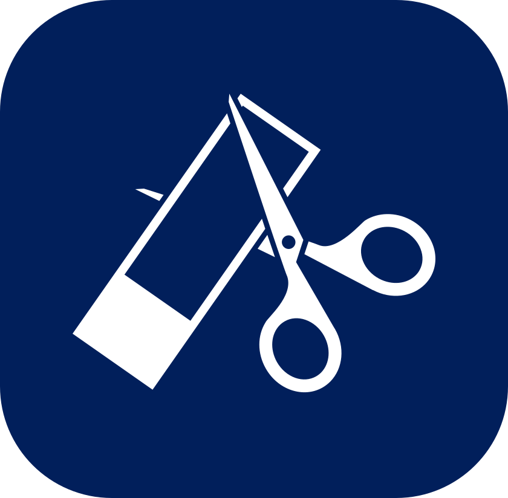

# Slides-Crop
Rapid cropping of slide images for histology analysis.

> [!NOTE]
> This is an application that is built for increasing efficiency of a very specific use case. This is NOT a general-purpose image processing software. If you're not sure what Slides Crop does, please read the following guide to see if Slides Crop is for you!

## Table of Contents
1. [Introduction](#1-introduction)
2. [Quick Start](#2-quick-start)
3. [Download and Installation](#3-download-and-installation)
    1. [Packaged Executables](#1-packaged-executables)
    2. [Package from Source](#2-package-from-source)
    3. [Run from Source](#3-run-from-source)
4. [Tutorial](#4-tutorial)
    1. [Startup Page](#1-startup-page)
    2. [Step 1: Adding Slides](#2-step-1-adding-slides)
    3. [Step 2: Making Selections](#3-step-2-making-selections)
5. [Acknowledgments](#5-acknowledgments)

## 1. Introduction
Welcome to Slides Crop! This is an image cropping application with a friendly GUI interface. Cropping specific sections from larger images generated by Leica LAS X Widefield Systems, etc. can be a time-consuming process. Slides Crop is created so that extracting and eventually cropping the selections from a larger image is easier and more efficient.

This application is created in the Jonathan A. Epstein Lab at the University of Pennsylvania. Visit our [X page](https://x.com/jonepsteinlab) or the [website of our principal investigator](https://www.med.upenn.edu/apps/faculty/index.php/g275/p12834)!

## 2. Quick Start
This is a quick start guide for using the application. Proceed to [section 3](#3.-Download-and-Installation) and [section 4](#4.-Tutorial) for a more detailed run-through of the application.

1. Download your operating system's executable from the [release page](https://github.com/RogerLzWang/Slides-Crop/releases).
1. Run the executable.
1. At the startup page, create a new project by entering your project's name and adjust the number of selections you need to make on each slide, along with the default selection size if needed. Hit "Create" to create a new project.
    > Don't worry if you don't know what you want for these settings. You can change these values in subsequent steps and it is suggested to continue with the default values.
1. On the next page, click "+ Add Slides" to add all the slides you wish to process in this project. After images are added, you can click and drag the images to reorder them. If you accidentally added an incorrect image, you can right click on it to remove it. Click "Next" when all the slides are added.
    > The application will generate previews when you add new images. Due to the larger size of slide images, the application may freeze for minutes. Please do not force quit the application and wait patiently until images are added successfully.
1. On the next page, you will see the first slide image along with the information, including the index, file name, image size, number of selections, and the current selection size.
    1. When in View Mode (default), you can use the scroll wheel or any native motion to zoom and move the image.
    1. Holding ```Ctrl``` (```Cmd``` on macOS) enters Selection Mode. You will see the cursor change into a crosshair. Clicking on the image in selection mode creates a selection at the cursor's location.
    1. You can move a selection by clicking and dragging in View Mode.
    1. Right-click on a made selection in View Mode removes it.
    1. You can go to different slides by using the arrow buttons found in the bottom right corner.
    1. When selections have been made for one or all slides, the Export/Export All button in the bottom right corner can be used to export the selections.
        > The application may freeze due to the large quantity of images. Please wait patiently until all selections are exported.
1. Save the project at any time to preserve your progress.

## 3. Download and Installation

### 1. Packaged Executables
The easiest way to download and use Slides Crop is to use a packaged executable. Currently, you can find executables for both Windows and macOS in the [release page](https://github.com/RogerLzWang/Slides-Crop/releases).

### 2. Package from Source
The authors uses Pyinstaller to package executables. If you would like to package from source, the SPEC files used by Pyinstaller are also provided.

Before packaging, install the following dependencies (it is recommended to do so in a virtual environment):

```
pip install PyQt6
pip install Pillow
pip install darkdetect
```

Then, use Pyinstaller to package the application.

```pyinstaller spec_Windows.spec``` or ```pyinstaller spec_macOS.spec```

### 3. Run from Source
With the dependencies installed, it is also possible to directly run the application from source. Simply ```python3 main.py```.

## 4. Tutorial

### 1. Startup Page
The user is greeted with the startup page when the application executes. The startup page contains two different sections, where a user can create a new project or open an existing one.

> The number of selections per slide option serves merely as a guide. User can export selections even with a different number of selections on a slide. This setting exists simply to help the user check the number of selections made.

 - Settings Button: The gear button in the top right corner. Before creating or opening a project, the user can change the resolution of the preview image generated (100%, 50%, 25%, or 10%; default 50%) or the color of the selection areas (defualt RGB(255, 0, 0)).
    > Selecting 100% resolution causes the application to use the most memory as the original image is displayed. Selecting a lower resolution initially makes the program quicker as no preview images need to be generated, at the cost of having less precise selections.

 - About Button: The info button in the top right corner. Displays the about page along with the information of the program and credits.

### 2. Step 1: Adding Slides
Upon creating or loading a project, the application jumps to step 1 automatically. The top banner shows the information of the project along with buttons to interact with the project.

The main area is a queue for slides to be added and ordered. Use the "+ Add Slides" button.

 - Return Button: The button in the top left corner. Clicking this button returns to the startup page and closes the project. User will be prompted to save the project if there are unsaved modifications.
 - Settings Button: The gear button in the top right corner. The user can change the project name, number of selections, and the default size of selection.
 - Save Button: The button in the top right corner. Saves the project to the existing project file; prompts the user to create a project file otherwise.
 - Save As Button: The button in the top right corner. Saves the project to a new file.

### 3. Step 2: Making Selections
The user can now make selections on the slide images after all slides are imported. Step 2 contains the same top banner as Step 1.

The largest region towards the left is an image viewer where selections are made. The image viewer is always in View Mode, with a hand-shaped cursor that allows the user to zoom and move the image. To make a selection, the user needs to hold ```Ctrl``` (```Cmd``` on macOS) to enter Selection Mode (cursor changes to crosshair) and click on the image.

The user can click and drag on a selection area in View Mode to move it. The user can right-click on a selection area in View Mode to remove it. Selection Mode is only for creating new selections.

> [!IMPORTANT]
> All selections need to be fully within the boundary of the image. The application will automatically adjust the location of a selection that goes over the edge(s) of the image area.

 - Arrow Buttons: The two arrow buttons in the bottom right corner. These buttons allow the user to switch images.
 - Export/Export All Button: The button with a drop-down in the bottom right corner. Clicking "Export" will export all the selections on the current slide. Clicking "Export All" will export all selections on all slides altogether.

## 5. Acknowledgments
The author is a research intern at the [Jonathan A. Epstein Lab](https://x.com/JonEpsteinLab) at the University of Pennsylvania. The work is instructed, supervised, and advised by [Diana Fulmer, PhD](https://dianafulmer.com), a postdoctoral researcher in the lab. Thanks to everyone in the Epstein Lab for making this application possible!

This application is made using Python3 and PyQt6. Pillow is used for image processing, and darkdetect is used to simplify the styling process. Internet sources are consulted and credits are given in the source code where appropriate.

## TODOs for Developers:
1. Progress bar for loading a slide (and generating previews).
1. Progress bar for exporting cropped images.
1. Drop to add slides.
1. The ability to switch themes without restarting the application.
1. Asterisk on title bar for modified project in Windows.
1. Packaged application for Linux.
